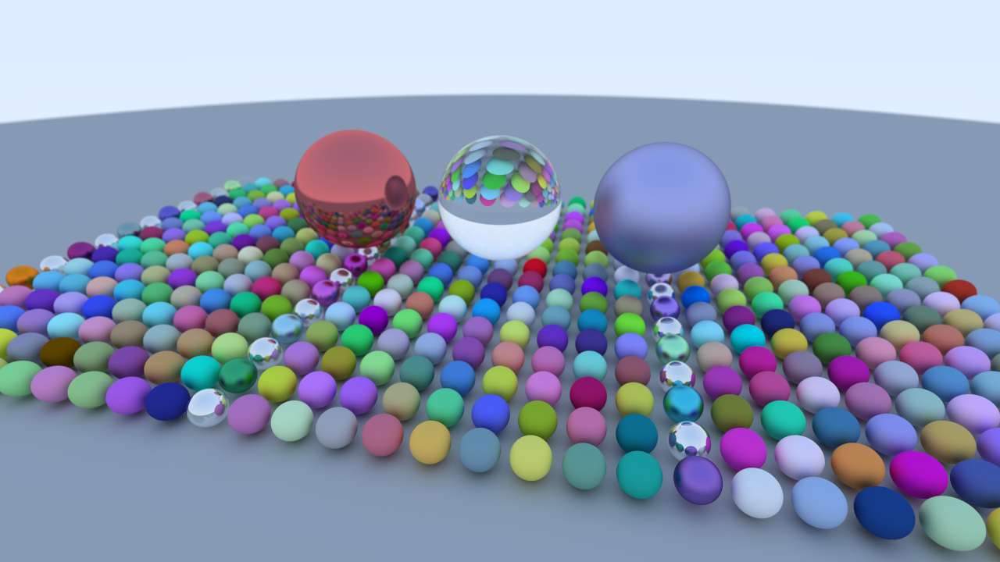
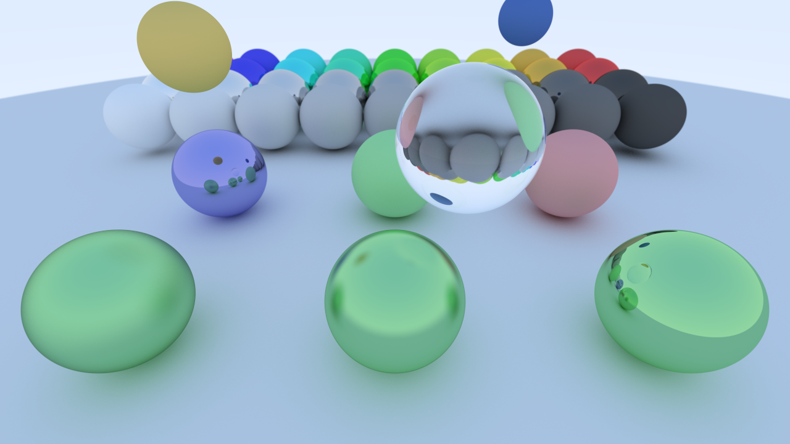
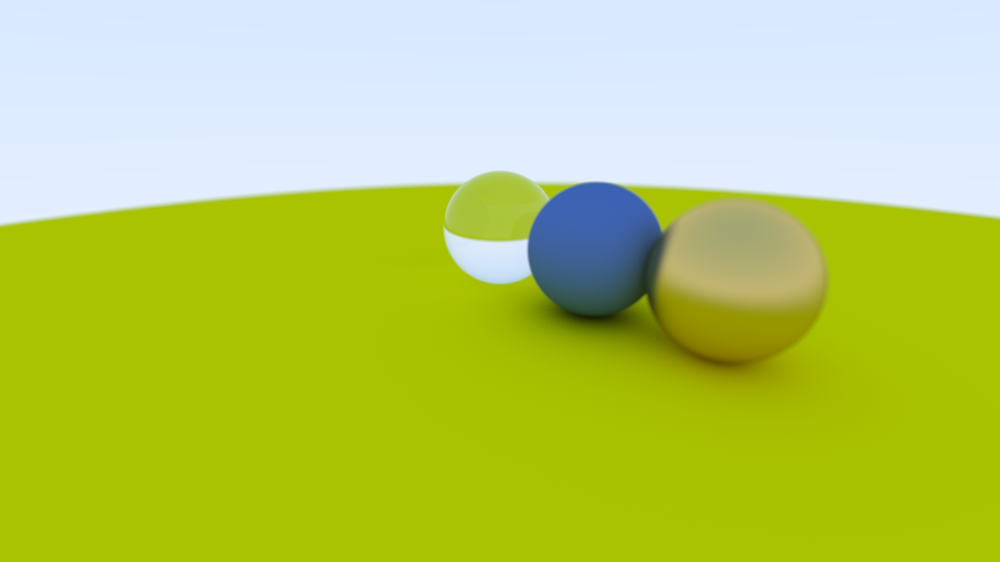
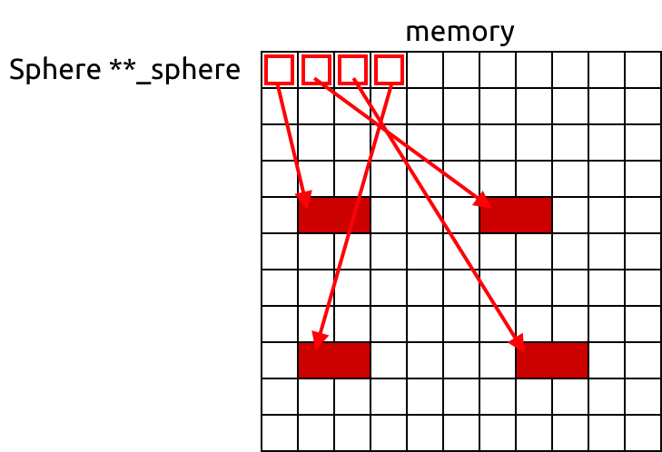
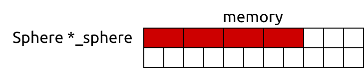
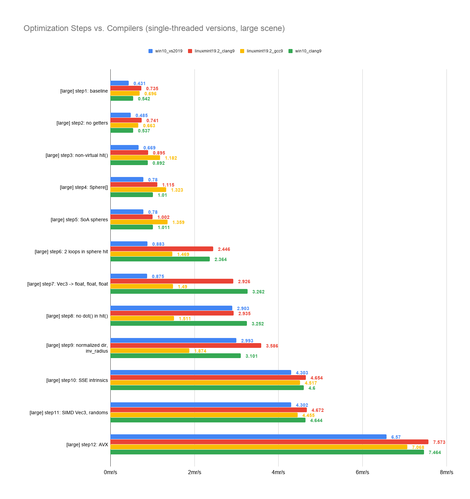
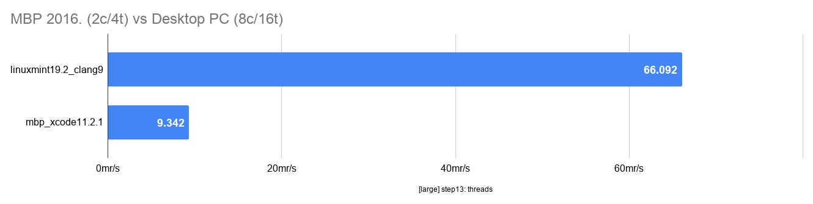
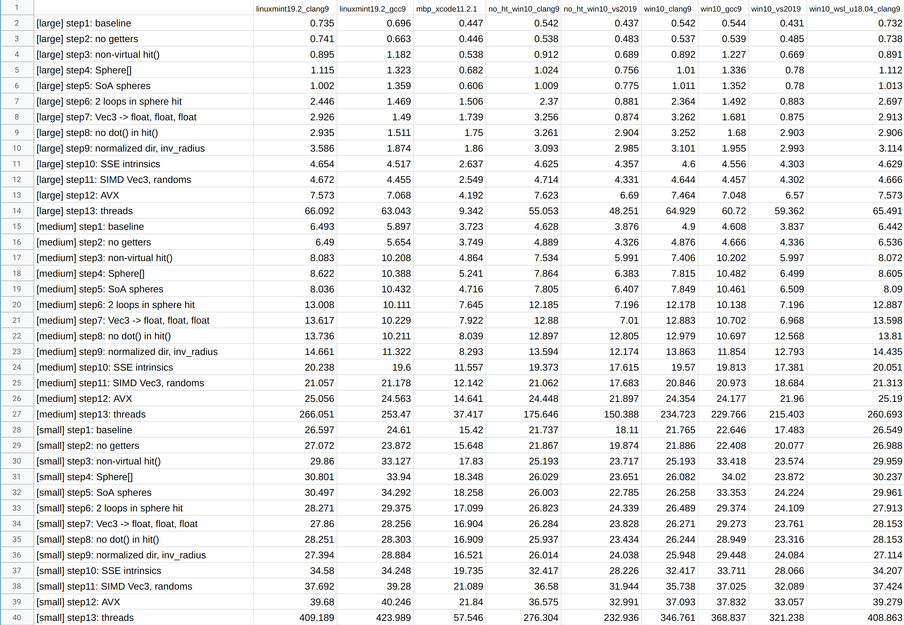

# Rays1
Simple path tracer and benchmark based on Peter Shirley's [Ray Tracing in One Weekend](http://in1weekend.blogspot.com/2016/01/ray-tracing-in-one-weekend.html), inspired by Aras Pranckevicius's [Daily Pathtracer](http://aras-p.info/blog/2018/03/28/Daily-Pathtracer-Part-0-Intro/).

## What's this?
After I read the Daily Pathtracer articles and Ray Tracing in One Weekend, I wanted to try out some different optimization techniques. Just for fun and excercise. It was nice to read and follow Peter Shirley's book, the source code is clear and easy to understand.

Large scene             |  Medium scene | Small scene
:-------------------------:|:-------------------------:|:-------------------------:
  |   | 

This writing is not about "how to create a fast path tracer for real world use cases". If you want a really fast solution you should use more advanced algorithms and data structures.
My goal was:
- experimenting with different optimization strategies like:
  - changing data layout (Array of Structures / Structure of Arrays)
  - assisting the compiler to produce better code
  - playing with SSE and AVX instructions
  - multi-threading
  - measuring the performance hit of virtual functions
- try out tools like linux [perf](https://perf.wiki.kernel.org/index.php/Tutorial) and the free [Intel VTune Amplifier](https://software.intel.com/en-us/vtune)
- compare different compilers
- make it faster without changing the rendering algorithm

I've just tried some modifications and I'm happy with the results even if it's possible to improve it even more.

## Content
- Step 1-9: trying out different data layouts and other small tricks and try to help the compiler to autovectorize the code.
- Step 11-12: SIMD intrinsics
- Step 13: multi-threading

Why bother with this? There are a few exceptions but most programs should be fast and efficient. Slow programs use a lot of energy, cost a lot, drain batteries faster. Servers, mobile and IoT devices all need efficient programs. Be green and write efficient programs! :)

## Results

For those who are impatient there are the results for Visual Studio 2019 + Windows 10 + Intel i9 9900K CPU with [unrestricted power limit](https://www.anandtech.com/show/13591/the-intel-core-i9-9900k-at-95w-fixing-the-power-for-sff).<br>
> Other compilers behave differently ([more on this](#steps)).

__RESULTS_MSVC2019_X64__

> Note: I had to increase the workload in step13 because it finished too quickly.

## Step 1. Preparations and Setting the Baseline
It's a small codebase and for simplicity I wrote most of the code in a single [file](src/step1/rayweek1.cpp).
My initial code is almost the same as Peter Shirley's reference implementation.

Code walk-through:<br>
`main()` calls `benchmark()` with every scenes: small, medium, large
```c++
benchmark(create_small_scene(), pixels, write_tga, "small");
benchmark(create_medium_scene(), pixels, write_tga, "medium");
benchmark(create_large_scene(), pixels, write_tga, "large");
```

Benchmark code is simple, some pseudo code:
```
// start time
clock_t t0 = std::clock();

// rendering
for every pixel in the screen buffer
    for every sample for this pixel
        calculate color

    result_pixel = average_of_samples

// end time
clock_t t1 = std::clock();

// write the result to a text file
log_results("baseline", id, elapsed_seconds, num_rays);

// write TGA if needed
tga_write_rgb24(filename, SCREEN_W, SCREEN_H, pixels);
```

`clock()` isn't the most precise timing function but we measure a couple of seconds so granularity is not a problem and it's cross platform.
> `clock()` will be replaced in the multi-threaded version

We save the results in a text file for automatic processing by our python [script](update_readme.py).

`Scene` class contains the camera and the list of the spheres.<br>
`color()` finds the closest intersecting sphere and calculates the color based on sphere material. Returns background color if no spheres hitted.

For implementation details you should read Peter Shirley`s [minibook](http://www.realtimerendering.com/raytracing/Ray%20Tracing%20in%20a%20Weekend.pdf).<br>
A few changes I've made:
- I've used the numerically more stable `(1 - t) * a + t * b` formula for linear interpolation instead of `a + (b - a) * t` ([wiki](https://en.wikipedia.org/wiki/Linear_interpolation))
- `Vec3` members are public (x/y/z)
- image is written in .tga format instead of .ppm and disabled by default, it requires `-w` option from command line
- using fixed random seed for consistency and [xorshift](https://en.wikipedia.org/wiki/Xorshift) to generate random numbers
- extended with benchmark: every run the program renders 3 scenes:
  - [small](src/step1/rayweek1.cpp#L535) scene: it contains only 5 spheres. This is only for proving that for small N it's almost impossible to improve single-threaded performance.
  - [medium](src/step1/rayweek1.cpp#L559): 46 spheres, it's the same as the one used in Daily Pathtracer.
  - [large](src/step1/rayweek1.cpp#L625): 484 spheres, 1/20 of them are dielectric, 1/10 of them are metal.


I saved every version of the program to a unique folder because I wanted to test all versions on different computers with different compilers and I wanted to make it easy to automatize. They are saved in the src/step1, src/step2, ... directories. The latest version is in the src/latest directory.<br>
Configurations like screen size and samples per pixel are in [src/common/common.h](src/common/common.h)<br>
You can read about benchmarking [here](#benchmarking) if you want to benchmark your system.

We have the baseline!
__RESULTS_MSVC2019_X64_step1__

## Before We Start

We need to set goals. <br>
I've optimized the program for execution speed. This program is not used in any real world scenario and thus we don't have any real data about usage patterns for example screen size, samples per pixel and number of spheres.
- if we use extra large screen like 32k x 32k pixels and 1000 spp and only 1-2 spheres, we will spend a lot of time with generating random numbers and calculating camera rays. The time spent finding the closest sphere is probably negligible
- if we have a few hundreds of spheres, we will spend almost all the time finding the closest intersecting sphere
- if we have millions of spheres, we have to worry about caching more (and it's even more insane idea to use linear searching :))
- if we have 100 billion spheres, we have completely different problems

In general this program is optimized for regular resolutions (HD, full hd, 4K, ...) with 1-1000 spp and not more than a few thousand spheres. <br>
I'm focusing on the large and medium test scenes. As a minimum goal, I want to beat the performance of the Toy Path Tracer :)<br>
I'm targeting x86_64 architecture with AVX2 instructions. I'm developing it mainly on Windows 10 with Visual Studio 2019 but regularly checking the performance on linux and macOS with gcc and clang too.<br>

### What are CPU-s Doing?

Basically every program does the same:
- reads instructions from memory
- reads data from memory
- computes the result
- writes the result to memory

Any of them can be a bottleneck and we can improve all of them.

Modern processors are beasts, they are capable of doing incredible amount of operations in best case scenarios. Our job is to be as close to these scenarios as possible :)

How big problem is when the CPU has to wait to load some missing data?<br> Most instructions can be executed in a few cycles on modern CPU-s and in worst case it takes a few hundred cycle to load a missing data from the memory. That's a lot of wasted time. CPU performance increases higher rate year over year than memory speed, so this bad situation is getting worse as time passes by.

Think about that you have to cook pancakes as fast as you can. What can go wrong?
- If you don't know how to cook a pancake you have to read the book for cooking instructions and it will definitely slow you down. System memory contains data and instructions for your program. If your code is not cached, it takes the processor more time to read and decode it. For example C++ virtual functions and unpredictable conditions can hurt performance a lot.
- If you don't have ingredients on your desk it will slow execution down too. If ingredients are in the refrigerator it's like an L1 cache miss :) If you have to go to the pantry it takes even more time like an L2 cache miss. If you have to go to the shop it's like you have to load the data from your disk.
- How fast can you break the eggs? Can you use both of your left and right hands simultaneously? Can you simplify the steps without changing the results?
- You finished baking the pancake but you don't have a plate to store it? So sad, you have to wait. (it's rare in single-threaded code)

Of course it's a highly simplified example, modern CPU-s are incredibly complicated and do a lot of tricks to run codes very fast even if they are poorly written. There is a very good article about [performance speed limits](https://travisdowns.github.io/blog/2019/06/11/speed-limits.html).


Compilers can optimize your calculations, reduce the overhead of function calling by inlining, reorder your instructions and do a lot of tricks, but it won't help you much if your memory access pattern is wrong and the CPU has to wait for the input data.<br>
Does your compiler support SIMD (single instruction, multiple data) and auto vectorization? Good. But it's your job to organize your data properly, otherwise the CPU will stall.<br>
The highest priority of compilers is correctness, not performance. If it cannot prove that an optimization won't mess up your calculations, it won't do it.<br>
Spend some time to learn more about your tools and compiler.

## Step 2. Public Ray Members
Everybody knows that those simple getter functions are inlined by the compiler and do not make any performance hit:
```c++
// class Ray

// note: all the functions defined inside the class are implicitly inline
Vec3 origin() const
{
    return _origin;
}

Vec3 direction() const
{
    return _dir;
}
```
Are we right or are we wrong? Make the members public and remove the getter functions:
```c++
struct Ray
{
    // ...

    Vec3 _origin;
    Vec3 _dir;
};
```
... and check it!<br>

__RESULTS_MSVC2019_X64_step2__
It helps at least to the MSVC compiler, that's a great first step to improve our little program! <br>
Why does it perform better? I've checked the generated assembly code and:
- adding `__forceinline` to origin() and direction() in step1 didn't help to improve the performance
- nothing prevented inlining these functions, there is neither `call origin` nor `call direction` instruction in the generated assembly code of step1
- despite all that the MSVC compiler generates more instructions for Sphere::hit() in step1 than in step2.

> Note: rant by Casey Muratori against setters/getters: [video](https://www.youtube.com/watch?v=_xLgr6Ng4qQ)


## Step 3. Non-virtual hit()

In the book there is a `Hitable` base class for everything that can be hit by rays. Every derived classes has to override the hit() function:
```
bool hit(Ray ray)
{
    if ray hit this thing
        return true
    else
        return false
}
```

We have only 2 derived classes:
```
Hitable
    |--Sphere (data for 1 sphere. hit() function returns true, if ray hits the sphere)
    |--HitableList (list of `Hitable`s. hit() returns true, if ray hits any element of the list)
```
It's easy to add new hitable types and we can build a hierarchy.
One big drawback is that we have to make the hit() function virtual and it can degrade performance.

Can we remove virtual function call without losing the flexibility?<br>
Yes, of course. We introduce `Hitable` struct, which contains
- array of `Sphere`-s
- array of `Hitable`-s

Extending our little path tracer with new features is still easy. For example for rendering meshes we need a new Mesh class and an array of Mesh-es in `Hitable`.

```c++
struct Hitable
{
    // [..]

    bool hit(const Ray& r, float t_min, float t_max, HitRecord* rec) const
    {
        // [..]

        // spheres
        for (uint32_t i = 0; i < _num_spheres; ++i)
        {
            if (_spheres[i]->hit(r, t_min, closest_so_far, &temp_rec))
                // [..]
        }

        // hitable lists
        for (uint32_t i = 0; i < _num_hitables; ++i)
        {
            if (_hitables[i].hit(r, t_min, closest_so_far, &temp_rec))
                // [..]
        }

        return hit_anything;
    }

    // spheres
    Sphere** _spheres = 0;
    uint32_t _num_spheres = 0;

    // meshes, etc.
    // ...

    // list
    Hitable* _hitables = 0;
    uint32_t _num_hitables = 0;
};

```

Remember: we spend a lot of time finding closest Ray-Sphere intersections. For a full hd screen with 100 spp in our large scene with 484 spheres we call the virtual function hit() at least 1920\*1080\*100\*484 times (roughly 100 billion times plus bounced rays). What if we remove the overhead of a virtual function call?

__RESULTS_MSVC2019_X64_step3__

Removing virtual function calls from hit detection code was a huge benefit.<br>
Speedup of the small scene is lower than speedup of the medium and the large scenes. We have only 5 sphere objects in the small scene and 5 virtual function calls for every sample in a pixel. Therefore reducing this overhead has less impact overall.

## Step 4. Array of Spheres
The scene contains a lot of `Sphere` objects and we allocate them one by one with operator new thus they are scattered in the memory. During rendering we iterate all the Sphere objects from the first one to last one. It seems obvious that we should pack them in the memory next to each other.

Currently we have "array of Sphere pointers". It looks like this in the memory:


I was curious how far these Sphere objects are in the memory from the previous ones:

```c++
int num_bad = 0;
long long worst = 0;
long long average = 0;
uint8_t *lowest_ptr = (uint8_t*)world->_spheres[0];
uint8_t *highest_ptr = lowest_ptr;

for (uint32_t j = 1; j < world->_num_spheres; j++)
{
    // distance from previous Sphere object
    long long distance = (uint8_t*)world->_spheres[j] - (uint8_t*)world->_spheres[j - 1];

    if (distance != sizeof(Sphere))
    {
        num_bad++;

        average += abs(distance);

        if (abs(distance) > worst)
            worst = abs(distance);

        printf("%3d. 0x%p distance from previous: %lld\n", j, world->_spheres[j], distance);
    }

    // minimum / maximum values of sphere pointers
    if ((uint8_t *)world->_spheres[j] < lowest_ptr)
        lowest_ptr = (uint8_t *)world->_spheres[j];

    if ((uint8_t *)world->_spheres[j] > highest_ptr)
        highest_ptr = (uint8_t *)world->_spheres[j];
}

average /= world->_num_spheres;

// results
printf("sizeof(Sphere): %d, num_bad: %d / %d, worst case: %lld, average: %lld, hi-lo: %lld\n",
        (int)sizeof(Sphere),
        num_bad,
        world->_num_spheres,
        worst,
        average,
        (long long)(highest_ptr - lowest_ptr));
```

And a typical result on my Windows 10 machine:
```
[..]
471. 0x000001AF6C626680 distance from previous: 1376
472. 0x000001AF6C6261A0 distance from previous: -1248
473. 0x000001AF6C6264E0 distance from previous: 832
474. 0x000001AF6C626380 distance from previous: -352
475. 0x000001AF6C6263C0 distance from previous: 64
476. 0x000001AF6C626560 distance from previous: 416
477. 0x000001AF6C6266A0 distance from previous: 320
478. 0x000001AF6C6265E0 distance from previous: -192
479. 0x000001AF6C626960 distance from previous: 896
480. 0x000001AF6C626C60 distance from previous: 768
481. 0x000001AF6C6268E0 distance from previous: -896
482. 0x000001AF6C626CE0 distance from previous: 1024
483. 0x000001AF6C626D20 distance from previous: 64
sizeof(Sphere): 24, num_bad: 483 / 484, worst case: 12032, average: 647, hi-lo: 43808
```
The average distance between two `Sphere` objects is more than 600 bytes, it's far from ideal.

Let's change the code and allocate an array of Spheres, it will look like this:



__RESULTS_MSVC2019_X64_step4__

Not a dramatic change but it's nice. The bigger the scene, the bigger the advantage is. Even 484 Sphere objects are a small amount of data, only 484\*24 = 11KBytes.

## Step 5. SoA Spheres

We can arrange our data in the memory in multiple ways.

Array of structures (AoS):
```c++
struct AoS
{
    float x, y, z;
};

AoS my_aos = new AoS[SIZE];

// processing
for (int i=0; i<SIZE; i++)
    my_aos[i].x = 111;
```

Structure of arrays (SoA):
```c++
struct SoA
{
    float *x;
    float *y;
    float *z;

    void SoA(int n)
    {
        x = new float[n];
        y = new float[n];
        z = new float[n];
    }
};

SoA my_soa(SIZE);

// processing
for (int i=0; i<SIZE; i++)
    my_soa.x[i] = 111;
```

AoS data layout in memory: `XYZXYZXYZ...`<br>
SoA data layout in memory: `XXX...YYY...ZZZ...`

Both of them have advantages and disadvantages.

Usually SoA is the best layout when you want to use SSE or other SIMD technology. Also if struct has a lot of members but you process only a few of them in a for loop, SoA has the advantage of higher information density. <br>
However: *"Note that SoA can have the disadvantage of requiring more independent memory stream references. [..] This can require the use of more prefetches, additional address generation calculations, as well as having a greater impact on DRAM page access efficiency."*
(Intel optimization guide 4-22)

AoS is simplier in most cases and may perform better in some situations: non-SIMD processing of data or random accessing of objects could be faster.

Later we will use SSE and AVX instructions, it seems to be a good idea to rearrange our sphere data in SoA. <br>
Sadly there is no native support in C++ for structure-of-arrays.<br>
What are the SoA alternatives for std::vector\<X\> ?
- The simplest version is just to write it by hand. You write the code to initialize, clean up, resize, etc. your arrays. It works and easy to read but after you wrote almost the same code 3 times, you will search for something more generalized solution.
```c++
struct Enemy
{
    float *x
    float *y;
    int *hitpoints;

    void resize(int new_size) { ... }
    void remove(int idx) { ... }
    void cleanUp() { ... }
    // ...

private:
    int _capacity;
    int _size;
    // allocator?
};
```

- Some people write C++ templates for SoA data structure layout. It's far from simple and the result is... well, I have mixed feelings :) One problem is that it's hard to write and read the template code and it's full of C++ magic and traps. Bigger problem is that the *usage* of the implementations I've seen looked cumbersome for *me*. Also it's a template so expect slow compilations and possible sluggish debug performance.<br>
But if you like it, use it. Write your own or find an implementation like [this](https://github.com/crosetto/SoAvsAoS) or [this](https://www.fluentcpp.com/2018/12/21/an-soa-vector-with-an-stl-container-interface-in-cpp/).
- Almost the same as the first solution, but instead of writing the code by hand, you can generate it.<br>
To generate SoA arrays I wrote a python [script](soa_generator/soa_generator.py). It uses a single allocated byte buffer to store all members and handles aligning too. The config file is a python [file](src/step5/soa_generator_config.py).

The generated c++ class looks like this:

```c++
class SphereSOA
{
    [..]
    struct InstanceData
    {
        void *_buffer;
        uint32_t _count;
        uint32_t _capacity;

        // actual members we want to use
        Vec3 * __restrict center;
        float * __restrict radius;
        Material ** __restrict material;
    };
};
```

> Note: center, radius and material point into the \_buffer and will never overlap so it's safe to use `__restrict` which helps the compiler to generate better code. Without `__restrict` the compiler has to generate very conservative code sometimes to ensure correctness. With `__restrict`, we _promise_ to the compiler that center, radius and material pointers do not overlap.<br>
More: [Demystifying The Restrict Keyword](https://cellperformance.beyond3d.com/articles/2006/05/demystifying-the-restrict-keyword.html)

Benchmark it!

__RESULTS_MSVC2019_X64_step5__

This time there is no speedup :) That's OK. We do this rearrangement as a preparation for:
- making it easier for the compiler to autovectorize our hit detection loop
- making it easier for us to use SSE instructions

## Step 6. Multi-pass sphere_hit()

CPU-s love short, branchless loops.<br>
We spend most of the time in this loop (in medium and large scenes):

```c++
for (uint32_t i = 0, N = _soa_spheres.getCount(); i < N; ++i)
{
    if (sphere_hit(i, r, t_min, closest_so_far, &temp_rec))
    {
        hit_anything = true;
        closest_so_far = temp_rec.t;
        *result_rec = temp_rec;
    }
}
```
..and:
```c++
bool sphere_hit(int i, const Ray& r, float t_min, float t_max, HitRecord* rec) const
{
    const Vec3& center = _soa_spheres.getData()->center[i];
    const float radius = _soa_spheres.getData()->radius[i];

    Vec3 oc = r._origin - center;
    float a = dot(r._dir, r._dir);
    float b = dot(oc, r._dir);
    float c = dot(oc, oc) - radius * radius;
    float discriminant = b * b - a * c;
    if (discriminant > 0)
    {
        [..]
    }

    return false;
}
```
What does the `if (discriminant > 0)` mean? It's true if the ray hits the currently tested sphere. How often does this happen? I bet it's a rare case! Check it with a simple additional code. We count both cases:
```c++
if (discriminant > 0)
{
    g_NumTrue++;
    [..]
}
else
    g_NumFalse++;
```
and print the results:
```c++
printf("discr > 0:     %.2f%%\n", 100.0 * g_NumTrue / (double)(g_NumTrue+g_NumFalse));
```
```
small
discr > 0:     21.34%

medium
discr > 0:     3.68%

large
discr > 0:     0.45%
```
As expected, the more spheres we have, the lower the chance of a ray hitting the tested sphere.


Let's split the loop!

```c++
// 1. pass: calculate every discriminant
// our little program spends most of the time here
for (uint32_t i = 0, N = _soa_spheres.getCount(); i < N; ++i)
{
    const Vec3& center = centers[i];
    const float radius = radii[i];

    Vec3 oc = r._origin - center;
    float a = dot(r._dir, r._dir);
    float b = dot(oc, r._dir);
    float c = dot(oc, oc) - radius * radius;

    // save results
    discriminants[i] = b * b - a * c;
}

// 2. pass: check discriminants
for (uint32_t i = 0, N = _soa_spheres.getCount(); i < N; ++i)
{
    if (discriminants[i] > 0 && sphere_hit_splitted(i, r, t_min, closest_so_far, &temp_rec))
    {
        hit_anything = true;
        closest_so_far = temp_rec.t;
        *result_rec = temp_rec;
    }
}
```
Pros:
- no branching in the first loop
- it's easier for the compiler to autovectorize the code
- easy to convert to SIMD code (see later)

Cons:
- increased memory footprint: we need to store the discriminant of every sphere 
- we redundantly recalculate a, b, c in sphere_hit_splitted(). Luckily it's a rare case.

__RESULTS_MSVC2019_X64_step6__
Great improvement!

## Step 7. Vec3 -> float, float, float

What if we change the SoA sphere data from this:
```c++
Vec3 * __restrict center;
```
to this:
```c++
float * __restrict center_x;
float * __restrict center_y;
float * __restrict center_z;
```

Can it improve the performance?

__RESULTS_MSVC2019_X64_step7__

Nope.

## Step 8. Manual dot() in hit()
Another easy modification: replace our inline dot() function calls with manual dot product calculation:

Old:
```c++
Vec3 oc(r._origin.x - cx[i], r._origin.y - cy[i], r._origin.z - cz[i]);
float a = dot(r._dir, r._dir);
float b = dot(oc, r._dir);
float c = dot(oc, oc) - radius * radius;
```
New:
```C++
float ocx = r._origin.x - cx[i];
float ocy = r._origin.y - cy[i];
float ocz = r._origin.z - cz[i];
float a = r._dir.x * r._dir.x + r._dir.y * r._dir.y + r._dir.z * r._dir.z;
float b = ocx * r._dir.x + ocy * r._dir.y + ocz * r._dir.z;
float c = (ocx * ocx + ocy * ocy + ocz * ocz) - radius * radius;
```

Manually inlining a function instead of letting the compiler to do it? What a bad idea!

__RESULTS_MSVC2019_X64_step8__

Surprise! Why is this huge improvement?<br>
Add [/Qvec-report:1](https://docs.microsoft.com/en-us/cpp/build/reference/qvec-report-auto-vectorizer-reporting-level?view=vs-2019) to the command line to enable the reporting feature of the MSVC compiler auto-vectorizer.
Until step 7, it reports nothing. However in step 8:
```
--- Analyzing function: bool __cdecl Hitable::hit(struct Ray const & __ptr64,float,float,struct HitRecord * __ptr64)const __ptr64
rayweek1.cpp(104) : info C5001: loop vectorized
```
Hooray! Finally the compiler is capable of auto-vectorizing our hottest loop! (GCC has a similar option: `-fopt-info-vec-optimized`)

Conclusion: in theory, calling an inline function is the same as manual calculation. In practice, _sometimes_ there is a huge difference. (similar to step2)

## Step 9. Minor Optimizations: ray::dir and Precalculated Data

I cannot unsee the Daily Pathtracer, I have copied some idea from it: 

1. We store the direction of the ray as unit vector so we can make some simplification in the calculations.

```c++
Ray(const Vec3 &origin, const Vec3 &dir)
{
    _origin = origin;
    _dir = dir.getUnitVector();
}
```

By definition a unit vector has a length of 1. The dot product of any unit vector with itself is 1 too.<br>
Using this knowledge we can completely remove `a` from this expression:
```c++
float a = dot(r._dir, r._dir);
[..]
float temp = (-b - sqrtf(b * b - a * c)) / a;
```
Modified version:
```c++
float temp = (-b - sqrtf(b * b - c));
```

2. We store the radius of the sphere but we use always the square or the inverse of the radius. From now we store radius\*radius as `radius_sq` and 1.0/radius as `inv_radius`.

__RESULTS_MSVC2019_X64_step9__

## Step 10. SSE Intrinsics

SIMD stands for single instruction, multiple data.
A single SIMD instruction can perform the same operation on multiple data points simultaneously.
If you've never heard about it, there is a really nice introduction: [Crunching Numbers with AVX and AVX2](https://www.codeproject.com/Articles/874396/Crunching-Numbers-with-AVX-and-AVX). (although it's about the AVX instruction set, the 256 bits wide big brother of SSE)<br>
Some other good readings: [What is SSE and AVX?](https://www.codingame.com/playgrounds/283/sse-avx-vectorization/what-is-sse-and-avx) and [Intel Intrinsics Guide](https://software.intel.com/sites/landingpage/IntrinsicsGuide/).<br>
I'm not experienced in writing SIMD code, I'm curious how far I can go!

Hitable::hit() is still the hottest function. We're going to replace the 'find the closest intersecting sphere' loop. SSE registers are 128 bits wide so instead of a single 32-bit float data we can work with 4x 32-bit float data simultaneously. It's easy except a small tricky part :)

Old method:
```
pass1:
for i in 0..num_of_spheres, i += 1
    discriminant[i] = ...

pass2:
for i in 0..num_of_spheres
    if (discriminant > 0)
        check closer ray-sphere intersection
        check further ray-sphere intersection
```

We replace only the first pass with SSE instructions.
```
pass1:
for i in 0..num_of_spheres, i += 4
    calculate discriminant i, i+1, i+2, i+3

pass2:
    nothing changed
```

```c++
const __m128 ray_dir_x = _mm_set1_ps(r._dir.x);
const __m128 ray_dir_y = _mm_set1_ps(r._dir.y);
const __m128 ray_dir_z = _mm_set1_ps(r._dir.z);
const __m128 ray_origin_x = _mm_set1_ps(r._origin.x);
const __m128 ray_origin_y = _mm_set1_ps(r._origin.y);
const __m128 ray_origin_z = _mm_set1_ps(r._origin.z);


for (uint32_t i = 0, N = _soa_spheres.getCount(); i < N; i += SIMD_WIDTH)
{
    const __m128 ocx = _mm_sub_ps(ray_origin_x, _mm_load_ps(&cx[i]));
    const __m128 ocy = _mm_sub_ps(ray_origin_y, _mm_load_ps(&cy[i]));
    const __m128 ocz = _mm_sub_ps(ray_origin_z, _mm_load_ps(&cz[i]));

    __m128 b = _mm_mul_ps(ocx, ray_dir_x);
    b = _mm_add_ps(_mm_mul_ps(ocy, ray_dir_y), b);
    b = _mm_add_ps(_mm_mul_ps(ocz, ray_dir_z), b);
    _mm_storeu_ps(&all_b[i], b);

    const __m128 radius_sq = _mm_load_ps(&radii_sq[i]);
    __m128 c = _mm_add_ps(_mm_add_ps(_mm_mul_ps(ocx, ocx), _mm_mul_ps(ocy, ocy)), _mm_mul_ps(ocz, ocz));
    c = _mm_sub_ps(c, radius_sq);

    __m128 discr = _mm_sub_ps(_mm_mul_ps(b, b), c);
    _mm_storeu_ps(&discriminants[i], discr);
}
```

Remember: we spend almost all the time in the first pass.

> Note: if you check the source code, this is the `#define COLLECT   0` version.

The second loop is not vectorized. The reasons:
- I cannot do it :) (I need more experience with SSE)
- Probably it is useless. Likely only 1 of the 4 spheres intersects the ray.

Another idea! This multi-pass solution works pretty well, but the second for loop touches *every* element of the discriminant[] again. And we know that most of them are negative values. What if in the first pass we record the useful indices?<br>
The scalar version would look like this:
```c++
uint16_t positives[1024];
int num_positives = 0;

for (uint32_t i = 0; i < _soa_spheres.getCount(); ++i)
{
    // [..]
    discriminants[i] = b * b - c;

    if (discriminants[i] > 0)
        positives[num_positives++] = i;
}
```

Here comes the SIMD version:
```c++
__m128 discr = _mm_sub_ps(_mm_mul_ps(b, b), c);
_mm_storeu_ps(&discriminants[i], discr);

int mask = (~_mm_movemask_ps(discr)) & 15;

if (mask)
{
    if (mask & (1<<0))
        positive_idx[num_positives++] = i;
    if (mask & (1<<1))
        positive_idx[num_positives++] = i + 1;
    if (mask & (1<<2))
        positive_idx[num_positives++] = i + 2;
    if (mask & (1<<3))
        positive_idx[num_positives++] = i + 3;
}
```

It looks scary for the first time. Remember that we work with 4x floats simultaneously and there is no 'multiple-if' instruction in c++.
The highest bit of a 32-bit [floating point number](https://en.wikipedia.org/wiki/Single-precision_floating-point_format) is the sign bit. If it's 1, this is a negative number. If it's 0, the value is positive. This is why we have two representations of zero :)
The [_mm_movemask_ps](https://software.intel.com/sites/landingpage/IntrinsicsGuide/#text=_mm_movemask_ps&expand=3869) instruction copies the most significant bit (the sign bit) of each float. We have 4x floats, _mm_movemask_ps returns 4 bits of information.

Let's see an example:
```
discriminants[i]  : 10111111 10000000 00000000 00000000    // -1
discriminants[i+1]: 00111111 10000000 00000000 00000000    // +1
discriminants[i+2]: 10111111 00000000 00000000 00000000    // -0.5
discriminants[i+3]: 11000001 00100000 00000000 00000000    // -10
                    ^
                    sign bit

mask = _mm_movemask_ps(...)
mask: 00000000 00000000 00000000 00001101 (bin) or 13 (dec)
```

We're almost there! We want to filter the _positive_ values, not the negative ones. So invert every bit and clear the upper 28 bits: `mask = (~mask) & 15`

Continuing this example:
```
mask:       00000000 00000000 00000000 00001101 (bin) or 13 (dec)
~mask:      11111111 11111111 11111111 11110010 (bin)
(~mask)&15) 00000000 00000000 00000000 00000010 (bin)
```

If mask is non-zero, it means that 1, 2, 3 or 4 discriminants are positive.

In the second pass, we iterate only these registered indices, which is probably a much smaller amount of data:
```c++
for (int i = 0; i < num_positives; ++i)
{
    ....
}
```

This is the `#define COLLECT   1` version that runs a little faster on my machine.

Other small changes in the code:
- Hitable::hit(): the results are calculated only in one place (result_rec-> lines). I've seen it in the Daily Pathtracer! :)
- Sphere_hit_splitted() function is removed and inlined manually in Hitable::hit().
- Hitable::hit(): the values of `b` are stored too to reduce redundant calculations, which increases memory footprint slightly
- Because we work with a group of 4 spheres, we must ensure that the number of spheres is multiple of 4. We have to add a few lines of code to the scene creator functions:
```c++
// make sure that the number of spheres is multiple of SIMD width
while (scene->hitables->_soa_spheres.getCount() % SIMD_WIDTH != 0)
    scene->hitables->_soa_spheres.add(Vec3(999999999, 999999999, 999999999), 0, nullptr);
```
We add place holder spheres that have radius of 0 and handle them carefully in hit detection.

Final version is [here](src/step10/rayweek1.cpp), results are here:

__RESULTS_MSVC2019_X64_step10__

Our naive SSE code performs pretty well.

> My minimal goal is reached as the program is a little faster now than the Toy Path Tracer on my computer, details are on the bottom of the page :)

## Step 11. Minor Optimizations

1. Vec3 is based on __m128 instead of "float x, y, z"

2. Another idea copied from Fabian 'ryg' Giesen:
[compute -b (nb) not b by flipping vector](https://github.com/aras-p/ToyPathTracer/pull/10/commits/fc7127c16df47e522e1d139a9279663cbc0d2f90)

3. Now I have 4 random functions:
- float myrand01() -> returns 0..1
- float myrand02() -> returns 0..2
- __m128 myrand01_x4 -> returns 0..1
- __m128 myrand02_x4 -> returns 0..2

Some cycles can be saved using them, for example:
```c++
random_in_unit_sphere()
OLD:
p = 2.0f * Vec3((float)myrand(), (float)myrand(), (float)myrand()) - Vec3(1, 1, 1);

NEW:
p = Vec3(myrand02_x4()) - Vec3(1.0f);
```

```c++
random_in_unit_disk()
OLD:
p = 2.0 * Vec3((float)myrand(), (float)myrand(), 0) - Vec3(1, 1, 0);

NEW:
p = Vec3((float)myrand02(), (float)myrand02(), 0) - Vec3(1, 1, 0);
```

5. Some calculations are simplified because we know that Ray::dir is a unit vector.

And the results of all these changes:

__RESULTS_MSVC2019_X64_step11__

Great for the small and medium scenes, almost nothing for the large scene. This is what I expected. The fewer number of spheres we have the bigger part of the total time we spend in random_in_unit_sphere() and random_in_unit_disk().

## Step 12. AVX (Advanced Vector Extensions)

AVX over SSE:
- registers are 256 bits wide instead of 128 bits, they hold 8 floats instead of 4
-  data must be aligned on a 32-byte boundary
- and [more](https://en.wikipedia.org/wiki/Advanced_Vector_Extensions)

Important note for AMD CPU owners: before Zen2 (2019), AMD processors emulated instructions on 256 bits wide data as 2x128 so it was supported but wasn't faster than SSE.

Start with an easy change:
```c++
#define SIMD_WIDTH  8
```

We change some variable types and function names (it's almost a simple search & replace):
```c++
OLD:
const __m128 ray_dir_x = _mm_set1_ps(r._dir.getX());
[..]

NEW:
const __m256 ray_dir_x = _mm256_set1_ps(r._dir.getX());
[..]
```
(__m128 is replaced with __m256 and the prefix in function names changed from \_mm\_ to \_mm256\_)

AVX2 instruction set introduces a new useful function: fused multiply-accumulation (FMA). It's faster than a multiply operation followed by an add and more precise too.<br>
Use it:
```c++
OLD:
__m128 c = _mm_add_ps(_mm_add_ps(_mm_mul_ps(cox, cox), _mm_mul_ps(coy, coy)), _mm_mul_ps(coz, coz));
c = _mm_sub_ps(c, radius_sq);

NEW:
__m256 c = _mm256_mul_ps(cox, cox);
c = _mm256_fmadd_ps(coy, coy, c);
c = _mm256_fmadd_ps(coz, coz, c);
```

_mm256_movemask_ps() returns 8 bits instead of 4:
```c++
int mask = (~_mm256_movemask_ps(discr)) & 255;

if (mask)
{
    if (mask & (1<<0))
        positive_idx[num_positives++] = i;
    if (mask & (1<<1))
        positive_idx[num_positives++] = i + 1;
    if (mask & (1<<2))
        positive_idx[num_positives++] = i + 2;
    if (mask & (1<<3))
        positive_idx[num_positives++] = i + 3;
    if (mask & (1<<4))
        positive_idx[num_positives++] = i + 4;
    if (mask & (1<<5))
        positive_idx[num_positives++] = i + 5;
    if (mask & (1<<6))
        positive_idx[num_positives++] = i + 6;
    if (mask & (1<<7))
        positive_idx[num_positives++] = i + 7;
}
```

That's all!

__RESULTS_MSVC2019_X64_step12__

Great!<br>
Of course it didn't double the performance because Hitable::hit() is not the only function in our program that takes time (especially in the small scene).


##  Step 13. Multi-threading

Our single-threaded performance is now at an acceptable level, it's time to utilize all of our cores!

Some random topics and questions:

Splitting the workload across multiple threads and then collecting the results always has some overhead.

We need a scheduler: I wrote a very simple one. Threads render small pieces of the final picture, in our case the tiles are 32x32 pixels. A thread requests a tile index from the scheduler. When there are no more tiles, the thread stops.
```c++
static void thread_function(TileRenderScheduler* scheduler, uint32_t thread_idx, ThreadData* td)
{
    int tile;

    while ((tile = scheduler->get_tile()) != -1)
        render_tile(tile, td);
}

int get_tile()
{
    int tile = _next_tile.fetch_add(1);
    
    if (tile < _num_tiles)
        return tile;
    
    return -1;
}

std::atomic<int> _next_tile = 0;
int _num_total_tiles = 0;    
```

Granularity: what's the ideal size of a tile? Small tiles -> big overhead because of the scheduler. Huge tiles: thread utilization can be low. After some experiments I have set tile size to 32x32 pixels.

How much threads should we use? On my 8-core CPU with hyper-threading enabled, std::thread::hardware_concurrency() returns 16.

The sphere structure contains temporary data (`discriminant` and `b`). Threads are not able to share these otherwise we get wrong results, they overwrite the results of the other threads. We have to make it per-thread data.

The CPU can change dynamically its frequency based on power consumption, temperature or some random boost time limit. Getting *consistent* performance and measuring it is *hard*. AVX heavy load on all cores -> throttling is expected.<br>
My CPU is able to run at 5.0GHz clock speed when 1 core is active and 4.7GHz (94%) when 8 cores are active. That's a limit, not the guaranteed speed. Actually it ran at 4.65GHz during benchmarking.

It turned out that `clock()` is unable to measure time in multi-threaded programs, so I replaced it with `std::chrono`. ([details]( https://stackoverflow.com/questions/2962785/c-using-clock-to-measure-time-in-multi-threaded-programs))

Hyper-threading: it can increase or decrease the performance. "SMT or HT Technology threads share the L1 instruction and data caches. If their memory access patterns are incompatible, they can end up fighting over the cache and causing many cache misses. In the worst case, the total performance for the CPU core can actually decrease when a second thread is run." ([source](https://docs.microsoft.com/en-us/windows/win32/dxtecharts/coding-for-multiple-cores#simultaneous-multithreading-and-number-of-threads))

Just for my curiosity I have tried a float8 wrapper class for __m256. It doesn't affect the performance but the code is slightly more readable.

I had to increase the workload in common.h:
```c++
#if MULTITHREADED
// multi-threaded version is too fast, need more work :)
#define NUM_SAMPLES_PER_PIXEL (10 * 25)
#else
#define NUM_SAMPLES_PER_PIXEL 10
#endif

#endif
```

Efficiency: in ideal case running on 8 cores / 8 threads is almost 8 times faster than on a single thread (job scheduling always has some overhead). Typically hyper-threading boosts performance by 10-30%. (8 cores / 16 threads).

[Source](src/step13/rayweek1.cpp) and results:

__RESULTS_MSVC2019_X64_step13__

## <a name="benchmarking"></a>Benchmarking

Do you want to benchmark your machine or your compiler?

Short version: open a terminal and run the bench.py script. Python3 and a c++ compiler is required.

Long version:<br>
Although there are project files for XCode and Visual Studio, I always run the benchmark from command line.<br>
You have two options to compile and run a program: do it directly or using bench.py.

- [src/common/common.h](src/common/common.h) contains the output config for all versions (screen size, spp)
- [bench.py](bench.py): compiles and runs all versions in "step1", "step2", ..., "latest" directories. Every directory contains at least the rayweek1.cpp. It produces out\_\*.txt and out\_\*.tga files.
- [src/latest/rayweek1.cpp](src/latest/rayweek1.cpp) is the latest version of the program.

Not needed for benchmarking but good to know: [update_readme.py](update_readme.py) collects results from step\*/out_\*.txt and updates README.md (the template file is README_template.md). I've used it for updating the article automatically.

Run bench.py. It has some options:
```
--all               Run all tests from step1 to latest
--latest            Run latest only
--single-threaded   Run latest single-threaded version (step12)
--step NUMBER       Run stepNUMBER
--cxx COMPILER      Select compiler, available options:
                        cl: MSVC compiler
                        clang or clang++ or clang++-9 or similar: clang
                        g++ or gcc or g++-9 or similar: g++

--quick             Quick bench (lower resolution and spp)
--compile-only      Compile programs but doesn't run
--num NUMBER        Number of runs (1..32)
--save              Save the output to a .tga file (src/step*/*.tga)
```

Open a terminal and run the script:

Windows:
- `python bench.py --latest`
- cl.exe should be in the path (run vcvars64.bat if it's in your path or start "x64 Native Tools Command Prompt for VS 2019")

Linux:
- `python3 bench.py --latest`
- g++ should be installed

macOS:
- `python3 bench.py --latest`
- clang should be installed

By default the program doesn't save the output image (in the multi-threaded version it can lead to inconsistent results). To store the image, use `-w` option, for example on Windows:<br>
```c++
step1\rayweek1.exe -w
```
>
Or if you use bench.py, add the `--save` option.
```c++
python bench.py --latest --save 
```

A few tips to get consistent results:
- set the CPU scaling governor to "performance" on linux ("powersave" is the default in most distributions)
- change power plan to "High Performance" on Windows
- disable real-time virus protection on Windows
- use a high performance cooler

MSVC compiler flags:<br>
```/Ox /fp:fast /D "NDEBUG" /arch:AVX2 /GL /link /LTCG'``` <br>
g++/clang flags:<br>
```-ffast-math -O3 -g -fno-rtti -fno-exceptions -std=c++17 -march=native -flto```<br>

Check [bench.py](bench.py) for compilation details.

## Some Benchmark Results

All results are in million rays / secs, higher is better.

All benchmarks ran on my machines:
- Intel i9 9900K (8c/16t), Noctua NH-D15S cooler, Windows 10 Home (1909) / Linux Mint 19.2.
- MacBook Pro 2016 without Touch Bar (2c/4t) / macOS Catalina

### Hyper-threading On/Off
Does hyper-threading boost the performance?
<br>
Speedup is 1.2x - 1.4x.


### <a name="steps"></a> Optimization Steps vs Compilers
I think it's pretty interesting to see how each optimization step changes the ranking of the compilers.
<br>
I've omitted the result of step13 (multi-threaded version) because it made the chart unreadable, but you can find all results [here](#allresults))<br>

### Price-performance Ratio, Desktop vs Laptop
It's a little unfair but let's compare my desktop PC and my Macbook Pro laptop. Their price was similar  (my PC was a little cheaper).
<br>

### <a name="allresults"></a> All Results
For those who like numbers :)
<br>


### Toy Path Tracer
To make the comparison fair, I disabled light sampling and set up similar parameters:
```c++
#define kBackbufferWidth 1280
#define kBackbufferHeight 720

#define CPU_CAN_DO_SIMD 1
#define DO_LIGHT_SAMPLING 0

// single-threaded
#define DO_SAMPLES_PER_PIXEL 10
#define CPU_CAN_DO_THREADS 0

// mt
#define DO_SAMPLES_PER_PIXEL (10*25)
#define CPU_CAN_DO_THREADS 1
```
On my computer the Toy Path Tracer of Aras can do 16.0 mrays/s in single-threaded mode and 165.4mrays/s running on 8c/16t.<br>
After I enabled the AVX2 instruction set in the project settings, the performance improved to 16.8mr/s and 168mr/s. (MSVC compiler)<br>
The best performance of my programs with MSVC compiler are 21.4mr/s in single-threaded and 212.1mr/s in multi-threaded version. (step12 and step13)


## Good Readings

In random order:

[Rules of optimization](http://www.humus.name/index.php?page=News&ID=383) by Emil Persson

[Performance Matters](https://travisdowns.github.io/) by Travis Downs

[How to optimize C and C++ code in 2018](https://medium.com/@aka.rider/how-to-optimize-c-and-c-code-in-2018-bd4f90a72c2b) by Iurii Krasnoshchok

[Optimizing software in C++](https://www.agner.org/optimize/optimizing_cpp.pdf) by Agner Fog

[Intel 64 and IA-32 Architectures Optimization Reference Manual](https://software.intel.com/sites/default/files/managed/9e/bc/64-ia-32-architectures-optimization-manual.pdf) by Intel

[Do You Prefer Fast or Precise?](https://devblogs.microsoft.com/cppblog/do-you-prefer-fast-or-precise/) by MS C++ Team blog

[Pitfalls of Object Oriented Programming - Revisited](https://docs.google.com/presentation/d/1ST3mZgxmxqlpCFkdDhtgw116MQdCr2Fax2yjd8Az6zM/edit#slide=id.g239d8c090f_0_97) by Tony Albrecht

[Memory, Cache, CPU optimization resources](https://gist.github.com/ocornut/cb980ea183e848685a36) by Omar Cornut

[easyperf.net](https://easyperf.net/notes/) by Denis Bakhvalov

[How to Write Code the Compiler Can Actually Optimize?](https://www.youtube.com/watch?v=x61H6qEtK08) by Mike Acton ([.pptx](https://raw.githubusercontent.com/macton/presentation-archive/master/gdc14_code_clinic.pptx))

[What We Talk About When We Talk About Performance](https://randomascii.wordpress.com/2018/02/04/what-we-talk-about-when-we-talk-about-performance/) by Bruce Dawson

## Thank you
Thanks to Attila Kocsis and Mihaly Kovacs for suggestions.